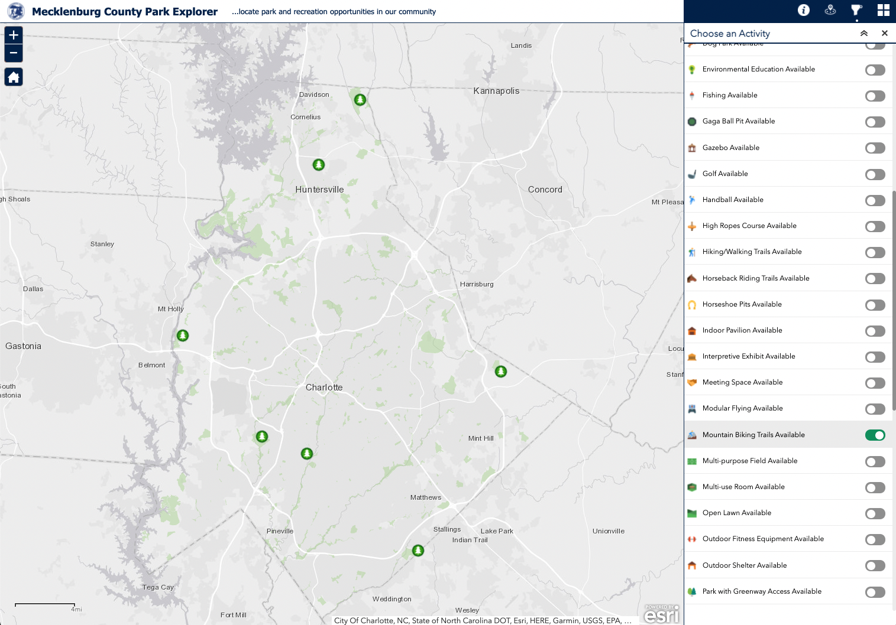
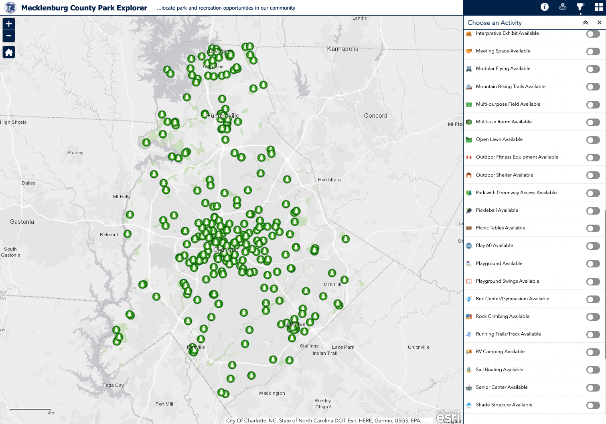

# Biking in Meck Co

Information about Mecklenburg County Parks and Recreation support for cycling

- Paved greenways
- Gravel and dirt double track
- Singletrack

### Links

- [Division of Nature Preserves and Natural Resources](https://www.mecknc.gov/ParkandRec/StewardshipServices/Pages/default.aspx)
- [MCPR Nature Trails and Amenities map](https://meckparknr.maps.arcgis.com/apps/View/index.html?appid=7c8402df7a67481d9dbcbd392940d719)

### Nature Preserves

This [map of 15 nature preserves](https://www.mecknc.gov/ParkandRec/Documents/brochure%20files/prk%20brochure%20nature.pdf) shows only one that allows any kind of cycling. See also this [list of nature preserves](https://www.mecknc.gov/ParkandRec/StewardshipServices/Pages/Nature-Preserve-Information.aspx)

### Community and Regional Parks

This [map shows 34 community and regional parks and 5 public golf facilities](https://www.mecknc.gov/ParkandRec/Documents/brochure%20files/prk%20brochure%20parks.pdf). **Only 3 of these parks have mountain bike Trails**: [Jetton Park](https://www.mtbproject.com/trail/7015390/jetton-park-mountain-bike-trail) (1 mile), [Colonel Francis Beatty Park](https://www.mtbproject.com/directory/8015505/colonel-francis-beatty-park) (12 miles), and [North Mecklenburg Park](https://www.mtbproject.com/trail/956695/north-mecklenburg) (2.9 miles)

For another view of the support, compare this ["biking" page](https://www.mecknc.gov/ParkandRec/StewardshipServices/Outdoors/Pages/Biking.aspx) which lists again this small quantity. Note, all of these also allow hiking. While the hiking page on their site lists several massive properties. Most of these ban bikes. 

### No bike signs

Check out this [map of no bike signs in Mecklenburg County](mecklenburg-no-bike-signs.geojson)

### Mecklenburg County Park Explorer

Consider the difference between these two views of the [Mecklenburg County Park Explorer](https://maps.mecklenburgcountync.gov/MecklenburgCountyParkExplorer/) with the mountain filter on and off. Visually, it's significant. But consider also that they list Fisher Farm (managed by Town of Davidson) and the Whitewater Center on the MTB filtered view!

###
